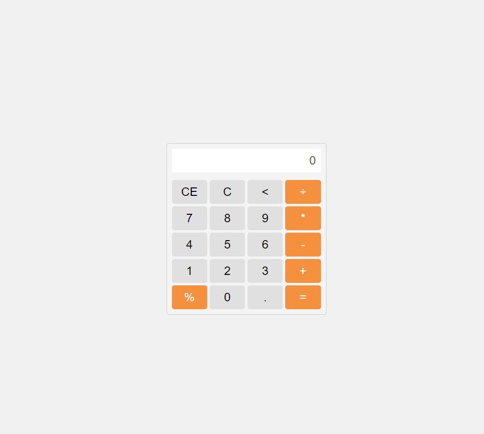

# Calculadora Web

Este é um projeto de uma calculadora web simples, desenvolvida com HTML, CSS e JavaScript.

## :rocket: Tecnologias Utilizadas

O projeto foi desenvolvido com as seguintes tecnologias:

- HTML 
- CSS
- JavaScript

## :rocket: Acesse o Projeto

Para experimentar a Calculadora Web, acesse o seguinte link: [Calculadora Web](https://dev-paixao.github.io/calculadora-web/)

## :rocket: Prévia do Projeto

## :clipboard: Sobre o Projeto

A Calculadora Web é uma calculadora simples que oferece funcionalidades básicas de cálculo, além de recursos adicionais como botão de retrocesso e cálculo de porcentagem. Com essa aplicação, é possível realizar operações matemáticas de adição, subtração, multiplicação e divisão, além de calcular porcentagens de forma rápida e fácil.

## :pushpin: Como Usar

1. Faça o clone deste repositório para o seu ambiente local.

2. Abra o arquivo `index.html` em seu navegador web.

3. Use os botões na calculadora para realizar as operações desejadas.

4. O resultado será exibido no visor da calculadora.

## :gear: Personalização

A Calculadora Web foi projetada com uma interface amigável e responsiva. Você pode personalizá-la de acordo com suas preferências, ajustando o design, as cores e os elementos visuais no arquivo CSS fornecido. Sinta-se à vontade para adaptar o projeto ao seu estilo ou necessidades específicas.

## :handshake: Contribuindo

Contribuições são bem-vindas! Se você deseja contribuir para este projeto, siga as etapas abaixo:

1. Faça um fork deste repositório.

2. Crie uma nova branch com uma descrição clara da sua alteração: `git checkout -b nome-da-sua-branch`.

3. Faça as alterações desejadas no código.

4. Realize commits com mensagens descritivas: `git commit -m "Descrição das alterações"`.

5. Envie as alterações para o seu repositório fork: `git push origin nome-da-sua-branch`.

6. Abra um pull request neste repositório, explicando as alterações que foram feitas.

7. Aguarde a revisão e o feedback.

## :page_facing_up: Licença

Este projeto está licenciado sob a licença [MIT](LICENSE).
