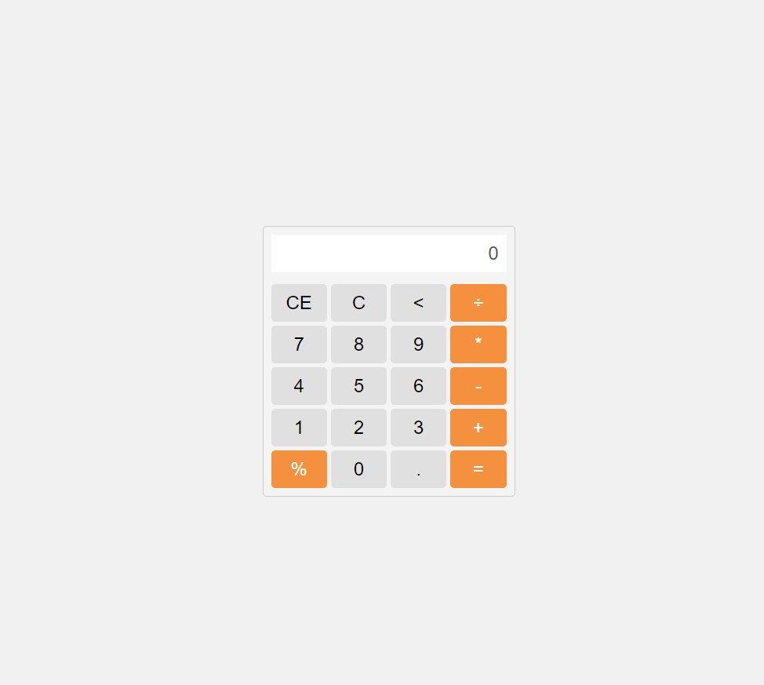

# Calculadora Web

Este é um projeto de uma calculadora web simples, desenvolvida com HTML, CSS e JavaScript. A calculadora oferece funcionalidades básicas de cálculo, além de recursos adicionais como botão de retrocesso e cálculo de porcentagem.

## Funcionalidades

- Realização de operações básicas: adição, subtração, multiplicação e divisão.
- Botão de retrocesso para apagar caracteres.
- Cálculo de porcentagem.
- Interface amigável e responsiva.

## Como usar

1. Faça o clone deste repositório para o seu ambiente local.
2. Abra o arquivo `index.html` em seu navegador web.
3. Use os botões na calculadora para realizar as operações desejadas.
4. O resultado será exibido no visor da calculadora.

## Contribuição

Contribuições são bem-vindas! Se você tiver sugestões de melhorias, correções de bugs ou novas funcionalidades, fique à vontade para enviar um pull request.

## Acesse o projeto

## [Clique aqui](https://dev-paixao.github.io/calculadora-web/)

## Licença

Este projeto está licenciado sob a [MIT License](LICENSE).
